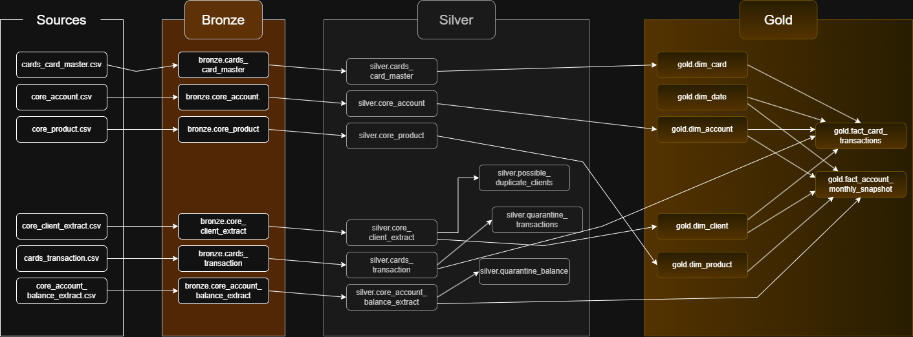
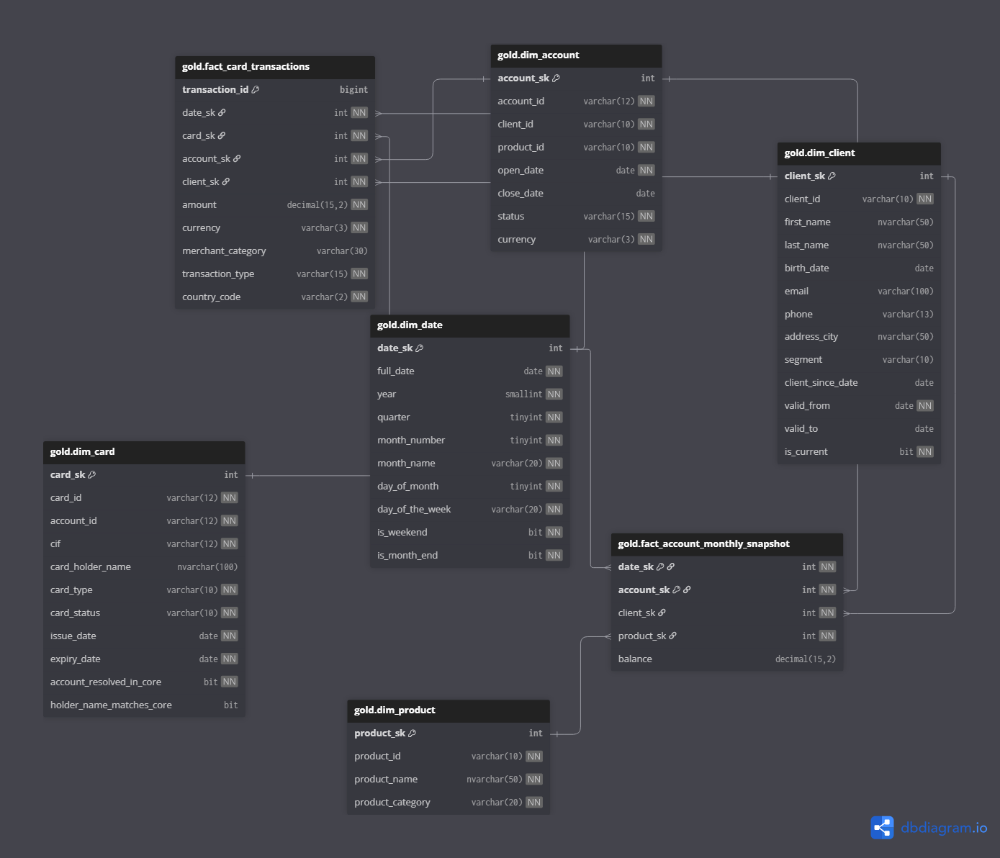

# 🏦 Lipa Bank a.s. – Banking Data Warehouse Project

A complete, end-to-end **SQL Server Data Warehouse** built on **Medallion Architecture** (Bronze → Silver → Gold), simulating a real-world banking scenario with two independent source systems and realistic data quality challenges.

---

## 📌 Project Overview

This project builds a data warehouse for a fictional retail bank **Lipa Bank a.s.**, consolidating data from two separate source systems that were never fully synchronized:

| System | Description |
|---|---|
| **CORE** – Core Banking System | Clients, accounts, products – periodic monthly extracts |
| **CARDS** – Card Processing System | Payment cards and transactions – different vendor, owns its own client reference |

Unlike typical portfolio projects with clean data, this project **intentionally simulates the messiness** found in real enterprise sources: inconsistent formats, missing values, orphan cross-system references, and business rule violations.

The full pipeline covers:
- Raw ingestion with zero transformation (Bronze)
- Data profiling and quality assessment (tests/)
- Findings & Recommendations document (docs/)
- Standardization, flagging, and quarantine (Silver)
- Star schema with SCD Type 2 ready for analytics (Gold)

---

## 🏗️ Architecture



### 🥉 Bronze – Raw Ingestion
- Data loaded as-is from CSV files via `BULK INSERT`
- All columns stored as `NVARCHAR` – no casting, no constraints
- Goal: preserve exactly what came from the source, including anomalies

### 🥈 Silver – Cleansed & Standardized
- Typed columns (`DATE`, `DECIMAL`, `BIGINT`, `DATETIME2`)
- Standardized formats: phone numbers → `+420XXXXXXXXX`, segment casing → `Retail/Premium/Private`
- Business rule violations routed to **quarantine tables**
- Cross-system inconsistencies **flagged** directly on the row
- Potential duplicate clients **logged** to a dedicated review table

### 🥇 Gold – Analytical Model (Star Schema)
- Dimensional model with surrogate keys
- `dim_client` with **SCD Type 2** for full historical change tracking
- **Unknown member** pattern (`sk = -1`) for safe handling of orphan references
- Two fact tables: transactional and periodic snapshot

---

## 💎 Data Model



### Dimensions

| Table | Type | Key attributes |
|---|---|---|
| `dim_client` | **SCD Type 2** | `valid_from`, `valid_to`, `is_current` – tracks segment, phone, city, email changes |
| `dim_account` | Type 1 | Bank accounts with product and status |
| `dim_card` | Type 1 | Cards with `account_resolved_in_core` and `holder_name_matches_core` flags |
| `dim_product` | Type 1 | 5 products across 2 categories |
| `dim_date` | Static | Calendar dimension 2024–2026 (1 096 days) |

### Facts

| Table | Grain | Description |
|---|---|---|
| `fact_card_transactions` | 1 row = 1 transaction | Card transactions with full surrogate key resolution |
| `fact_account_monthly_snapshot` | 1 row = 1 account × 1 month | Monthly balance snapshots |

---

## 🔍 Key Data Quality Findings

| Finding | Scope | Action |
|---|---|---|
| Phone in 4 different formats | 100 % of client rows | Standardized → `+420XXXXXXXXX` in Silver |
| Segment with inconsistent casing | 100 % of client rows | Standardized → `Retail/Premium/Private` |
| Missing email | 5.2 % | NULL preserved |
| Potential duplicate clients (same name + DOB, different `client_id`) | 3 groups / 6 clients | Logged to `silver.possible_duplicate_clients` |
| Orphan `account_id` in cards (not found in CORE) | 5.8 % of cards | Flagged `account_resolved_in_core = 0`, mapped to Unknown member in Gold |
| Card holder name mismatch vs. CORE client | 15.4 % of resolvable cards | Flagged `holder_name_matches_core = 0` |
| Negative balance on non-savings products | 1.21 % | Quarantined → `silver.quarantine_balance` |
| Negative Purchase/Withdrawal transactions | 0.98 % | Quarantined → `silver.quarantine_transactions` |
| Transactions outside card validity window | 1.26 % | Quarantined → `silver.quarantine_transactions` |

Full findings with recommended actions: [`docs/findings_and_recommendations.md`](docs/findings_and_recommendations.md)

---

## 📂 Project Structure

```
lipa-bank-data-warehouse/
│
├── datasets/                                        # Source CSV files (6 files)
│   ├── core_client_extract.csv
│   ├── core_product.csv
│   ├── core_account.csv
│   ├── core_account_balance_extract.csv
│   ├── cards_card_master.csv
│   └── cards_transactions.csv
│
├── docs/
│   ├── data_catalog_cz.md                             # Field descriptions for all layers (in czech)
│   ├── data_catalog_en                                # Field descriptions for all layers (in english)
│   └── images/
│       ├── medallion_architecture.png
│       └── gold_star_schema.png
│
├── scripts/
│   ├── init_database.sql                           # Create BankDataWarehouse DB + schemas
│   │
│   ├── bronze/
│   │   ├── ddl_bronze.sql                          # Bronze tables (all NVARCHAR, no constraints)
│   │   └── proc_load_bronze.sql                    # BULK INSERT from CSV → Bronze
│   │
│   ├── silver/
│   │   ├── ddl_silver.sql                          # Silver tables
│   │   └── proc_load_silver.sql                    # Transform, standardize, quarantine
│   │
│   └── gold/
│       ├── ddl_gold.sql                            # Gold star schema (dims + facts)
│       └── proc_load_gold.sql                      # SCD2 + Unknown members + COALESCE
│
└── tests/
    ├── profiling_check.sql                         # NULL %, format distributions, TRY_CONVERT checks
    ├── data_quality_checks.sql                     # Business rules + cross-system consistency
    ├── silver_dq.sql                               # Post-Silver DQ validation
    ├── bronze_load_validation.sql                  # Bronze row count check
    ├── silver_load_validation.sql                  # Silver row count check
    └── gold_load_validation.sql                    # Gold row count check
```

---

## 🚀 Features

- `BULK INSERT` from CSV with timing and structured error handling (`TRY/CATCH`)
- **Phone standardization** via `LIKE` pattern matching (4 formats → `+420XXXXXXXXX`)
- **Segment casing normalization** (7 variants → 3 canonical values)
- **Business rule quarantine routing** – two separate INSERT targets per violation type
- **SCD Type 2** for `dim_client` using `LAG()` / `LEAD()` window functions
- **Unknown member** (`sk = -1`) in all Gold dimensions for safe FK resolution
- **`COALESCE(sk, -1)`** in fact tables to handle orphan references without data loss
- Recursive CTE for `dim_date` generation (2024–2026)
- Post-load row count validation scripts for all three layers
- Data catalog and Findings & Recommendations documentation for stakeholder review

---

## ⭐ Prerequisites

- Microsoft SQL Server 2017 or later
- SQL Server Management Studio (SSMS) or Azure Data Studio
- Source CSV files placed in a local `datasets/` folder

---

## 🛠️ How to Run

1. Run `scripts/init_database.sql` – creates **BankDataWarehouse** database with `bronze`, `silver`, `gold` schemas
2. Run `scripts/bronze/ddl_bronze.sql` – creates Bronze tables
3. Run `scripts/bronze/proc_load_bronze.sql` – creates the load procedure
4. **Update the file paths** in `proc_load_bronze.sql` to point to your local `datasets/` folder
5. `EXEC bronze.load_bronze` – load raw data from CSV
6. Run `scripts/silver/ddl_silver.sql` – creates Silver tables
7. Run `scripts/silver/proc_load_silver.sql` and `EXEC silver.load_silver`
8. Run `scripts/gold/ddl_gold.sql` – creates Gold tables
9. Run `scripts/gold/proc_load_gold.sql` and `EXEC gold.load_gold`
10. Run any script in `tests/` to validate results

> ⚠️ `BULK INSERT` paths in `proc_load_bronze.sql` are set to a local drive path.  
> Update them to match your own `datasets/` folder location before running.

---

## 📊 Data Volume

| Layer | Table | Rows |
|---|---|---|
| Bronze | `core_client_extract` | 459 |
| Bronze | `core_account` | 206 |
| Bronze | `cards_card_master` | 172 |
| Bronze | `cards_transactions` | 3 483 |
| Silver | `cards_transactions` (after quarantine) | 3 405 |
| Silver | `quarantine_transactions` | 78 |
| Silver | `quarantine_balance` | 19 |
| Silver | `possible_duplicate_clients` | 3 |
| Gold | `dim_client` (incl. SCD2 versions + Unknown) | 178 |
| Gold | `dim_card` (incl. orphan cards + Unknown) | 173 |
| Gold | `fact_card_transactions` | 3 405 |
| Gold | `fact_account_monthly_snapshot` | 1 052 |

---

## 👤 Author

**Vaclav Benda**  
[github.com/VaclavBenda](https://github.com/VaclavBenda) · [linkedin.com/in/vaclav-benda](https://linkedin.com/in/vaclav-benda)
